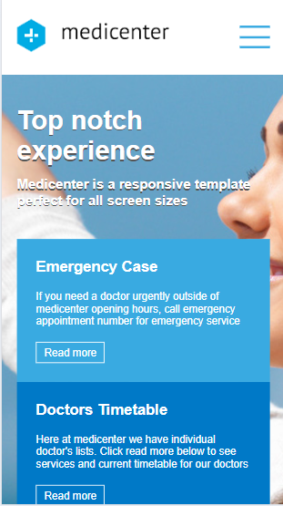
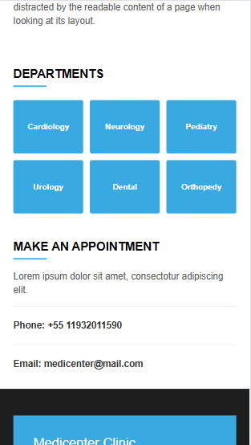

# 🏥 MediCenter — Clínica Médica

Projeto desenvolvido para colocar em prática conceitos de desenvolvimento web front-end, como semântica HTML, estilização avançada com CSS Flexbox e responsividade (Mobile First), através do curso **B7Web**.

---

### 📱 Demonstração Visual

#### Visão Desktop — Cabeçalho e Banner
> 

#### Visão Desktop — Seções e Departamentos
> 

#### Visão Desktop — Rodapé
> 

#### Visão Mobile — Responsividade
> <p align="left">
>   
>   
>   
> </p>

---

### 🛠 Tecnologias Utilizadas

* **HTML5**: Estruturação semântica.
* **CSS3**: Uso de Flexbox, Media Queries e Pseudo-elementos (`::after`) para conteúdo dinâmico.
* **JavaScript**: Lógica para manipulação do DOM e ativação do menu sanduíche.

---

### ✨ Principais Funcionalidades

* **Layout Totalmente Responsivo**: Adaptado para desktops, tablets e smartphones.
* **Menu Mobile**: Sistema funcional para navegação em telas pequenas.
* **Grade de Departamentos**: Seção estilizada com hover effects e preenchimento via CSS.
* **Informações de Contato**: Área dedicada para agendamentos e localização.

---

### 📥 Como clonar e executar

Para testar o projeto localmente, siga os passos:

```bash
# Clonar o repositório
git clone [https://github.com/HenriqueCastro18/MediCenter.git]

# Entrar na pasta do projeto
cd MediCenter

# Abrir o projeto no navegador (ou use a extensão Live Server no VS Code)
open index.html